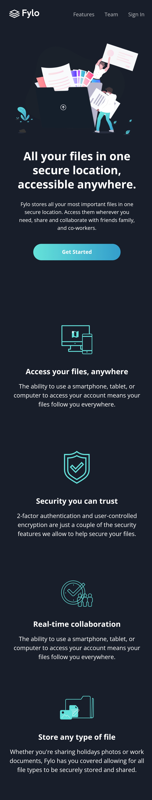
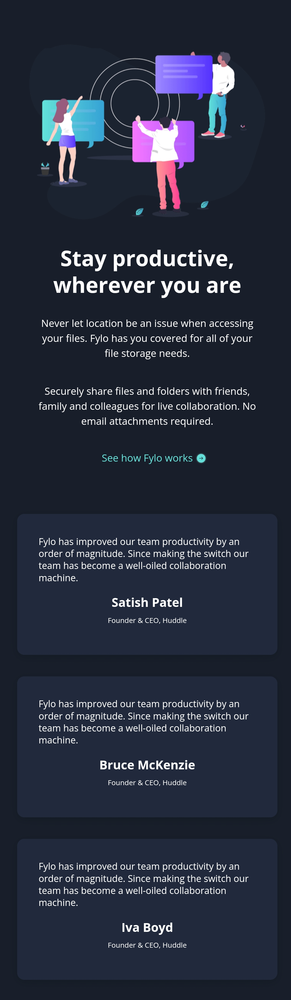
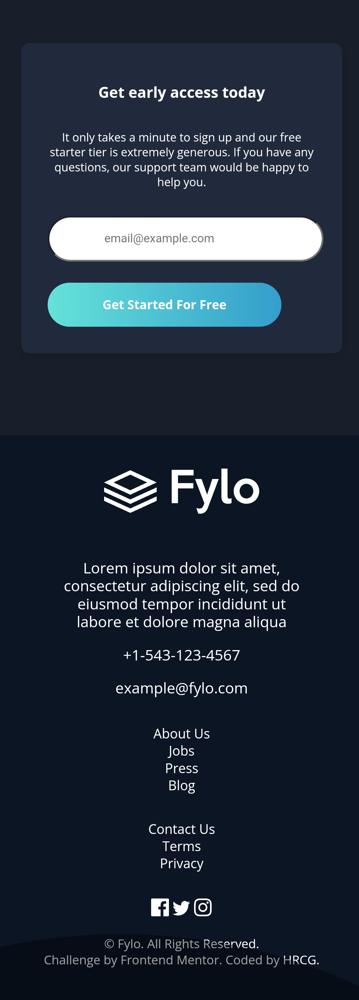

# Fylo

# Getting Started

To get started, I suggest you take a look at Github's quickstart guide [Fork a repo](https://docs.github.com/en/get-started/quickstart/fork-a-repo), as it goes into the necessary detail to get this project up and running.

# Overview

Frontend Mentor Challenge, I was able to mostly finish the mobile version of the site, desktop one needs a bit more work with media queries.
